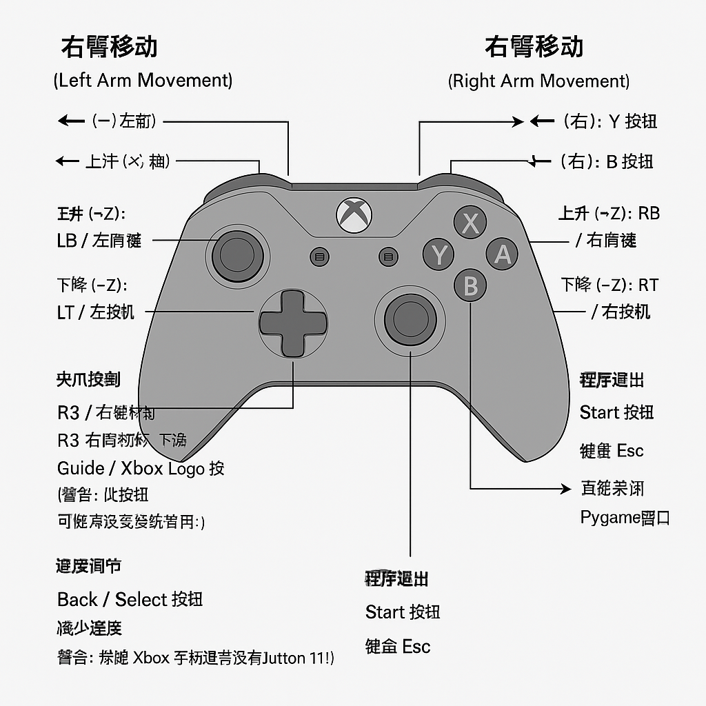

**左臂移动 (Left Arm Movement):**

* **X 轴 (左右):** 由 **方向键 (D-Pad / Hat 0)** 控制
    * ← (左): 方向键 X 轴 -1 (`left_arm_y_neg`) -> **Y 轴负向 (?)**
    * → (右): 方向键 X 轴 +1 (`left_arm_y_pos`) -> **Y 轴正向 (?)**
    * *(注意：你的配置中，方向键左右似乎映射到了 Y 轴，这可能不符合直觉，请检查 `config.yaml` 中的 `left_arm_x_pos/neg` 和 `left_arm_y_pos/neg` 配置)*
* **Y 轴 (前后/上下):** 由 **方向键 (D-Pad / Hat 0)** 控制
    * ↑ (上): 方向键 Y 轴 +1 (`left_arm_x_neg`) -> **X 轴负向 (?)**
    * ↓ (下): 方向键 Y 轴 -1 (`left_arm_x_pos`) -> **X 轴正向 (?)**
    * *(注意：你的配置中，方向键上下似乎映射到了 X 轴，这可能不符合直觉，请检查 `config.yaml`)*
* **Z 轴 (升降):**
    * 上升 (+Z): **LB / 左肩键** (Button 4)
    * 下降 (-Z): **LT / 左扳机** (Axis 2, 按下超过阈值)

**右臂移动 (Right Arm Movement):**

* **X 轴 (左右):**
    * ← (左): **A 按钮** (Button 0)
    * → (右): **Y 按钮** (Button 3) - *注意：通常 B (Button 1) 是右*
* **Y 轴 (前后/上下):**
    * ↑ (上): **X 按钮** (Button 2) - *注意：通常 Y (Button 3) 是上*
    * ↓ (下): **B 按钮** (Button 1) - *注意：通常 X (Button 2) 是下*
* **Z 轴 (升降):**
    * 上升 (+Z): **RB / 右肩键** (Button 5)
    * 下降 (-Z): **RT / 右扳机** (Axis 5, 按下超过阈值)

**夹爪控制 (Gripper Control):**

* **左夹爪 开/关 (切换):** **R3 / 右摇杆按下** (Button 9)
* **右夹爪 开/关 (切换):** **Guide / Xbox Logo 按钮** (Button 10) - **警告：此按钮可能无效或被系统占用！**

**速度调节 (Speed Adjustment):**

* **增加速度:** **Back / Select 按钮** (Button 6) - *注意：这与常见的 Start 加速相反*
* **减少速度:** **Button 11** - **警告：标准 Xbox 手柄通常没有 Button 11！** 你需要修改 `config.yaml`，将 `speed_decrease` 映射到一个实际存在的按钮。

**程序退出 (Exit):**

* **Start 按钮** (Button 7) - *根据 `config.yaml` 中的 `quit_button` 设置*
* 键盘 **Esc** 键
* 直接**关闭** Pygame 窗口

**请务必检查你的 `config.yaml` 文件，特别是:**

1.  **左右臂 XY 轴的映射**是否符合你的操作习惯（当前看起来有点混乱）。
2.  **右臂 XY 按钮的映射**是否符合你的操作习惯（当前设置与常见游戏布局不同）。
3.  **右夹爪 (Button 10)** 和**减速 (Button 11)** 的按钮是否有效，如果无效，请修改为手柄上实际存在的、可用的按钮索引号。